[TOC]

# Board

## Arduino Uno
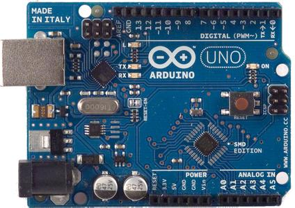{: width="350px" height="250px"}
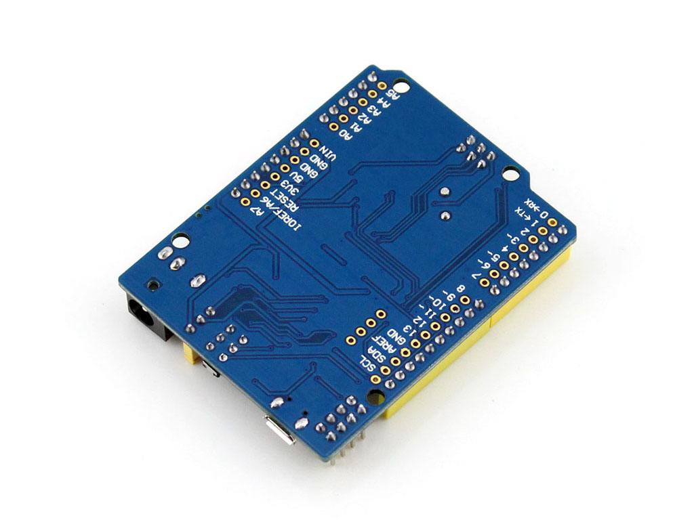{: width="450px" height="350px"}

## LinkIt One
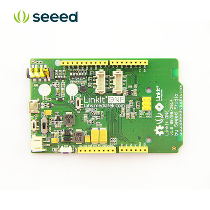{: width="400px" height="400px"}
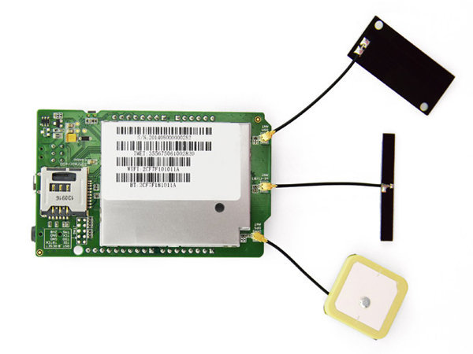{: width="400px" height="300px"}

## BeagleBone Black
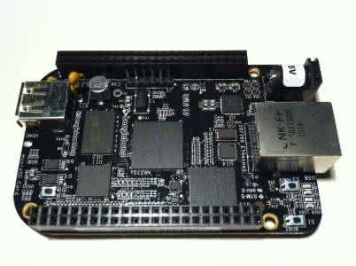{: width="400px" height="300px"}
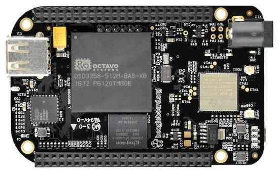{: width="400px" height="300px"}

## Raspberry Pi 2
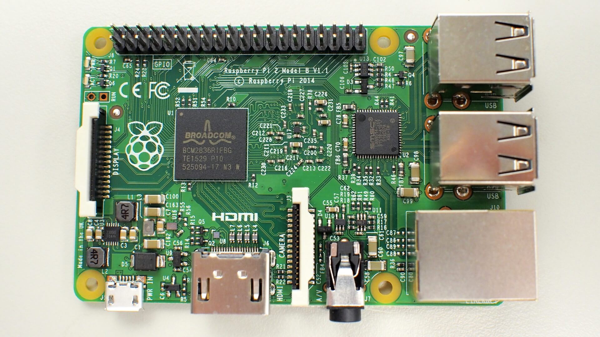{: width="400px" height="250px"}
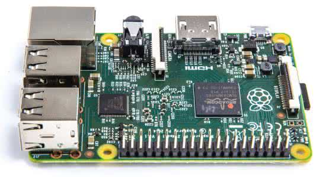{: width="400px" height="300px"}

# Shield

## Base Shield V2(3V3)

/1.jpg){: width="400px" height="300px"}
/2.jpg){: width="400px" height="300px"}

## Base Shield V2(5V)
/1.jpg){: width="400px" height="300px"}
/2.jpg){: width="400px" height="300px"}

## SD Card Shield V4
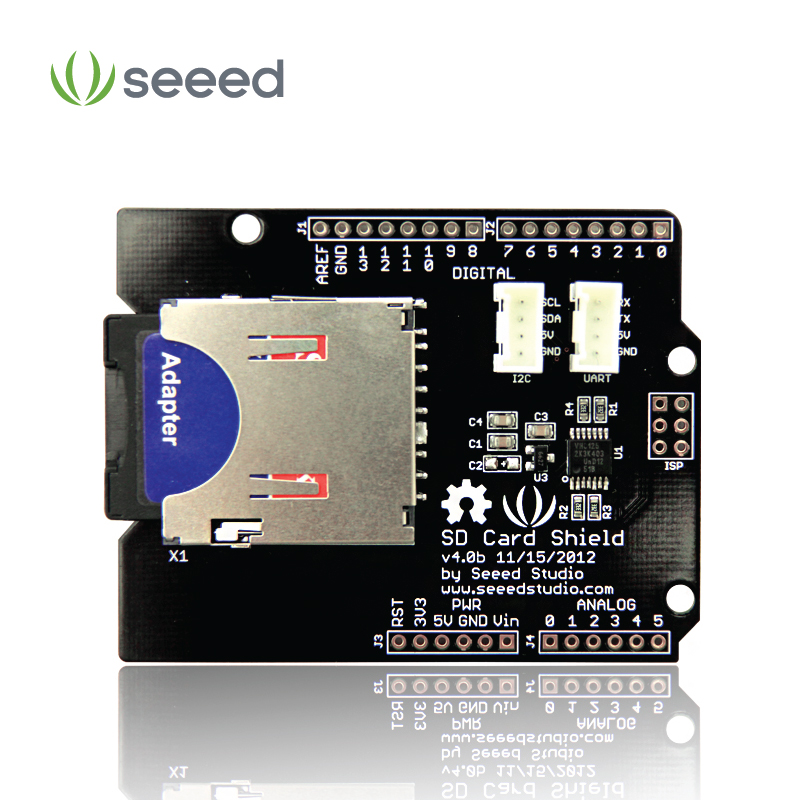{: width="400px" height="400px"}
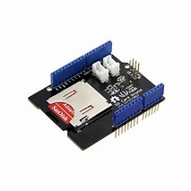{: width="400px" height="300px"}

## GrovePi+
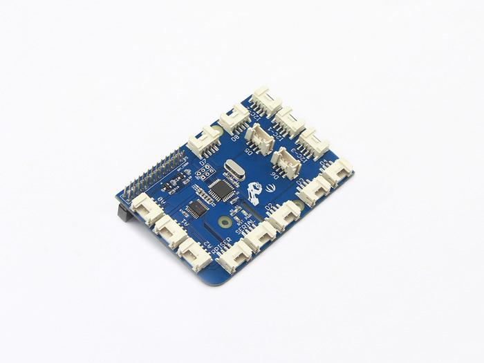{: width="400px" height="300px"}
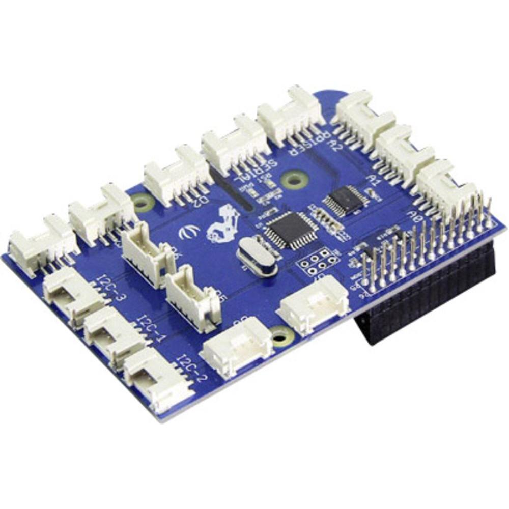{: width="400px" height="400px"}

## Grove Cape for BeagleBone Series(5V)
/1.jpg){: width="400px" height="300px"}
/2.jpg){: width="400px" height="400px"}

## Grove Cape for BeagleBone Series(3V3)
/1.jpg){: width="400px" height="300px"}
/2.jpg){: width="400px" height="300px"}

# Peripheral

## Grove Light Sensor
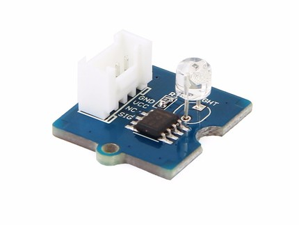{: width="250px" height="250px"}
{: width="200px" height="200px"}

## Grove Temperature and Humidity Sensor
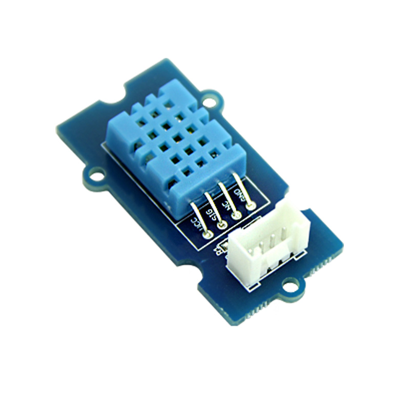{: width="250px" height="250px"}
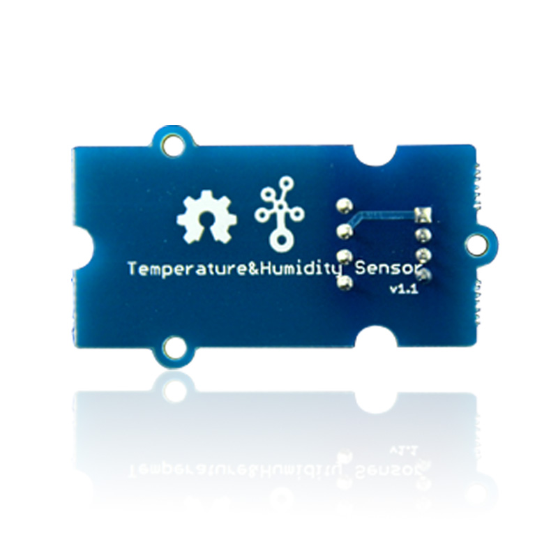{: width="250px" height="250px"}

## Grove Uart Wifi
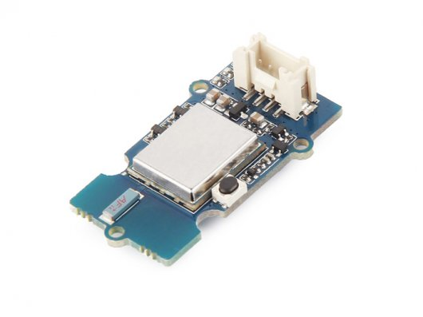{: width="250px" height="250px"}
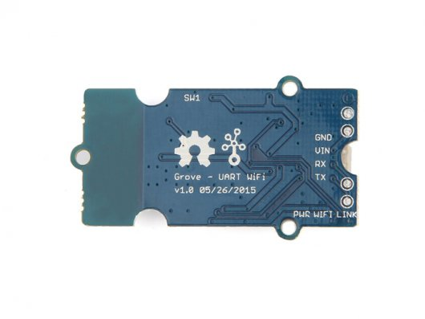{: width="250px" height="220px"}

## SDS018
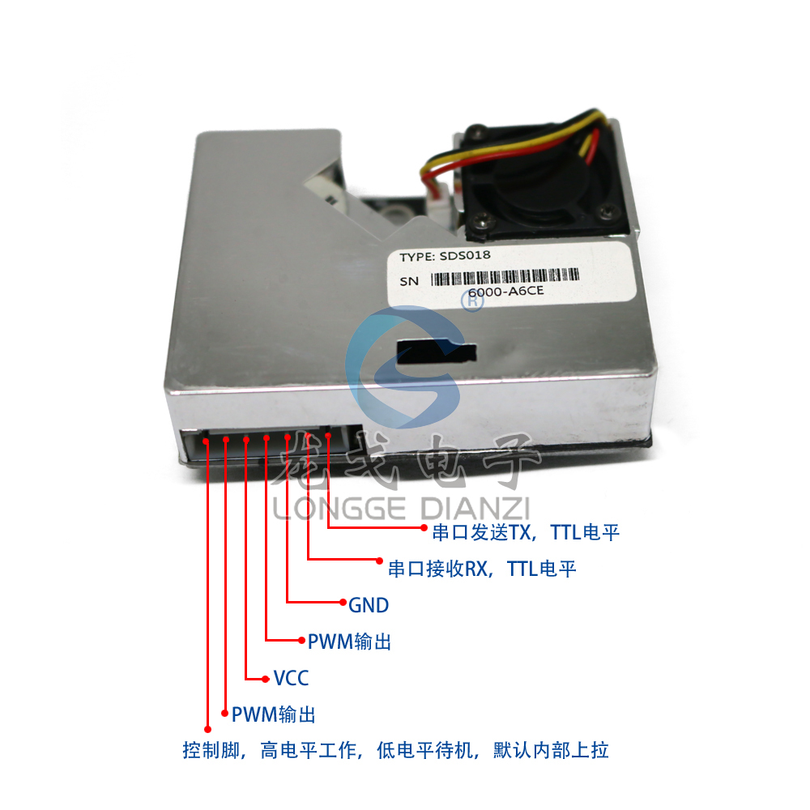{: width="505px" height="500px"}
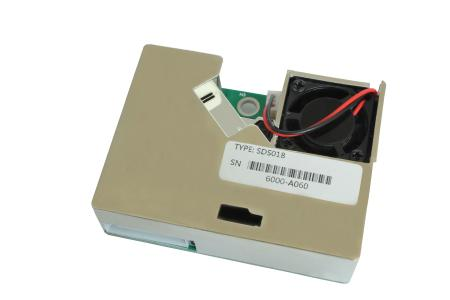{: width="400px" height="350px"}

## Soil Moisture Analog Sensor
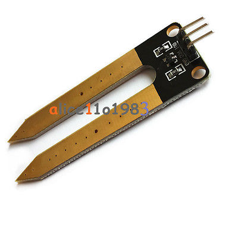{: width="250px" height="250px"}
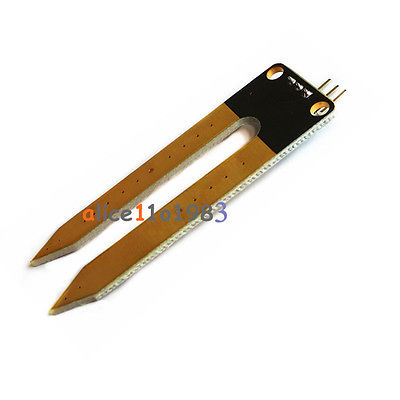{: width="250px" height="250px"}

## TL_WN725N Wireless network adapter
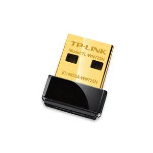{: width="250px" height="250px"}
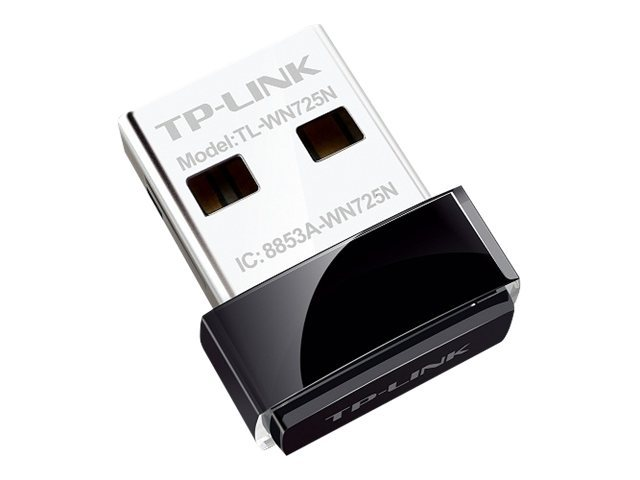{: width="250px" height="200px"}

# Others

## Dupont Line
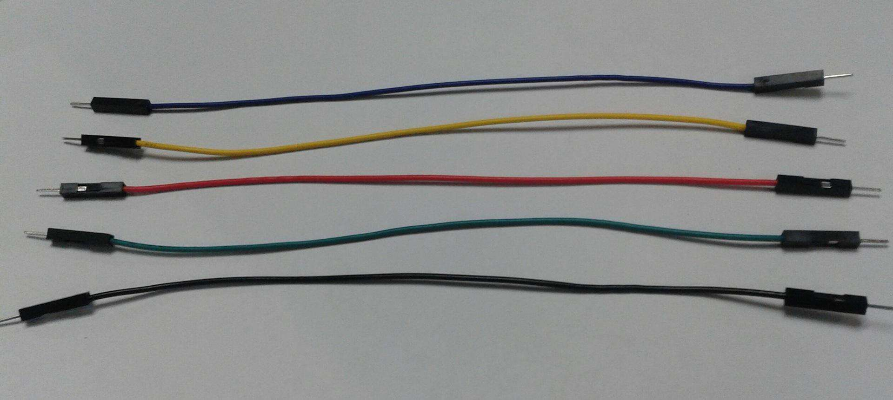{: width="500px" height="250px"}
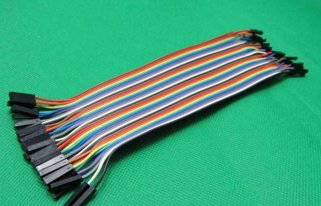{: width="500px" height="250px"}

## Micro USB Cable
{: width="300px" height="300px"}
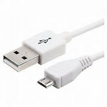{: width="300px" height="300px"}

## SD Card
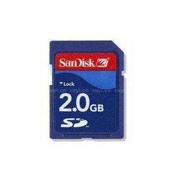{: width="250px" height="250px"}
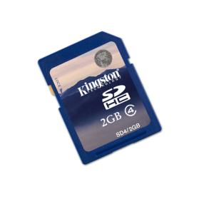{: width="250px" height="250px"}

## TF Card
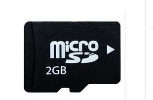{: width="250px" height="250px"}
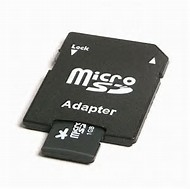{: width="250px" height="250px"}

## Universal 4 Pin Cable
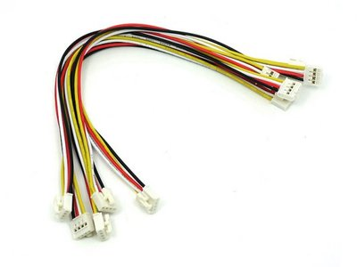{: width="300px" height="250px"}
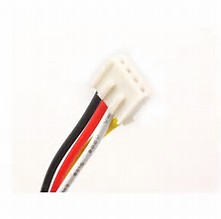{: width="300px" height="250px"}

## USB Cable Type-B
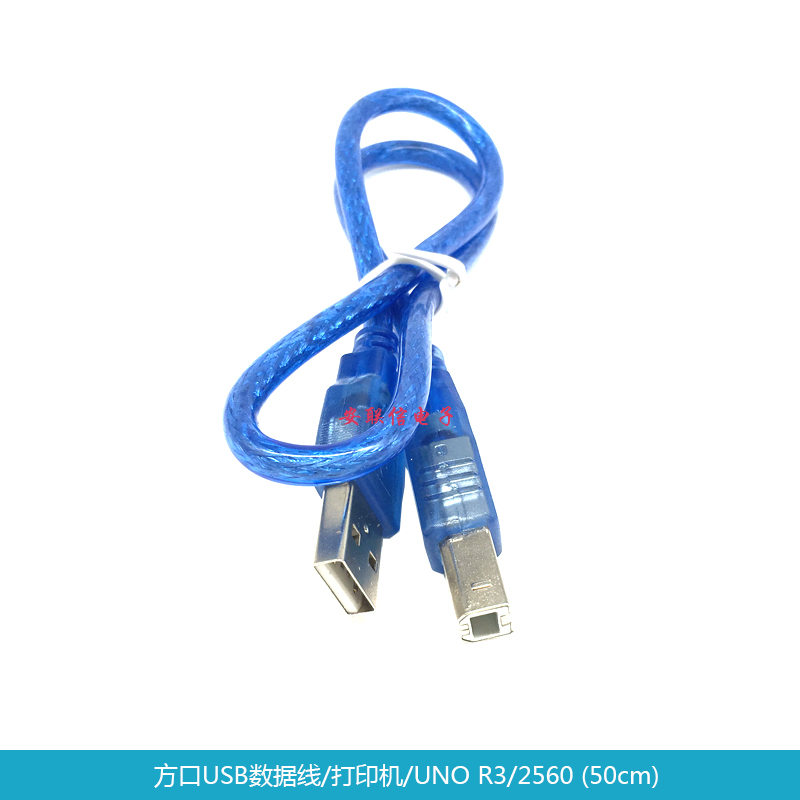{: width="300px" height="300px"}
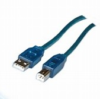{: width="300px" height="300px"}

