[TOC]

Welcome to the TinyLink get started guide. This guide takes you through the essential steps from setting up your development environment to running examples with the TinyLink system. The get started guide is divided into sections, each section includes summary steps.

# 1. What is TinyLink?
TinyLink is a **holistic** system for **rapid development** of IoT applications.  
Developers write the application code in C-like language to specify the key logic of their applications, without dealing with the details of hardware components.  
Taking the application code as input, TinyLink **automatically** generates hardware configurations as well as the hardware dependent code executable on the targeted hardware platform.

# 2.Preparations for using TinyLink
There are two steps for you to do the preparations for using TinyLink. After that, we will go through three examples.

## 2.1 Get the TinyLink hardware components
Theoretically, there is *NO NEED* for users to prepare the hardware components before using TinyLink.
However, in this getting started guide, we will go through prepared examples in the following section.
We need to prepare hardware components in the following table firstly.

<!--|LinkIt ONE|Arduino UNO R3|SD Card Shield V4|Base Shield V2|Grove Light Sensor|Grove Temperature and Humidity Sensor|SDS018|Grove UART WiFi|
|-|-|-|-|-|-|-|-|
|**Soil Moisture Analog Sensor**|**Dupont Lines**|**Grove Port Cable**|**SD Card 2G**|**TF Card 2G**|**USB Cable Type B**|**Micro USB Cable**||-->


|Component|Image|
|---|---|
|LinkIt_ONE|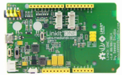|
|Arduino_UNO_R3||
|SD_Card_Shield_V4|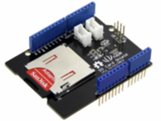|
|Base_Shield_V2|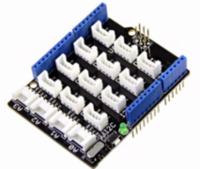|
|Grove_Light_Sensor|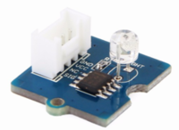|
|Grove_Temperature_and_Humidity_Sensor|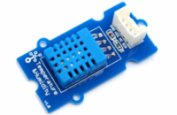|
|SDS018|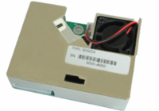|
|Grove_UART_WiFi|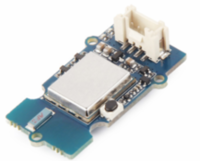|
|Soil_Moisture_Analog_Sensor|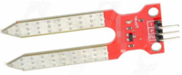|
|Dupont_Lines|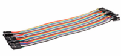|
|Grove_Port_Cable|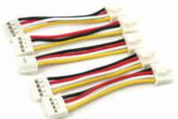|
|SD_Card_2G||
|TF_Card_2G|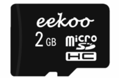|
|USB_Cable_Type_B|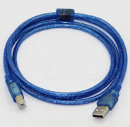|
|Micro_USB_Cable|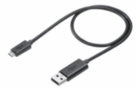|

## 2.2 Get the TinyLink client for Windows
The TinyLink Client for Windows provides a comprehensive development environment for developing IoT applications via TinyLink.
With this client, you can upload the source file, retrieve the generated hardware configuration and the binary program, as well as burn the binary to the assembled device.

### 2.1.1 For Windows users

#### Download the client
* Download URL: [http://tinylink.emnets.org](http://tinylink.emnets.org)
* Unzip the TinyLink_Client.zip you have just downloaded.

#### Install the drivers

##### For LinkIt One development board
* Find the driver **InstallMTKUSBCOMPortDriver.exe** in the folder **drivers**.  
    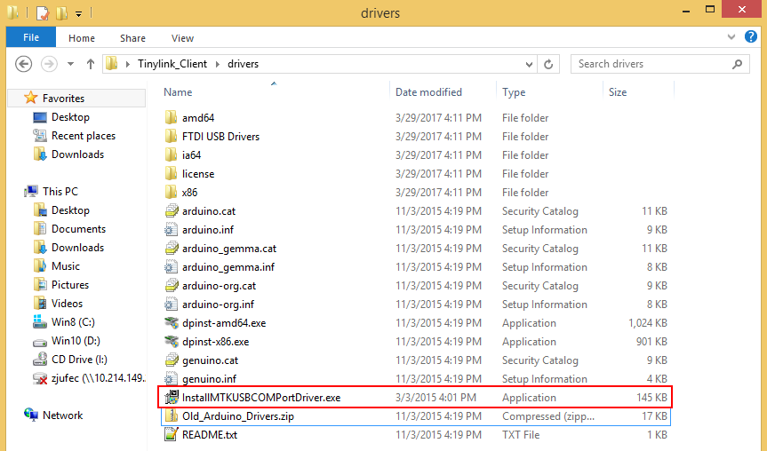  
* Open it and follow the installation instructions.

##### For Arduino UNO development board
* Attach the Arduino UNO to a computer via  USB Cable Type B.
* Open **"Control Panel(控制面板)"** and open **"Device Manager(设备管理器)"**.
* Find the **Arduino Uno** in **Other devices**, due to the drivers for this device are not installed.  
    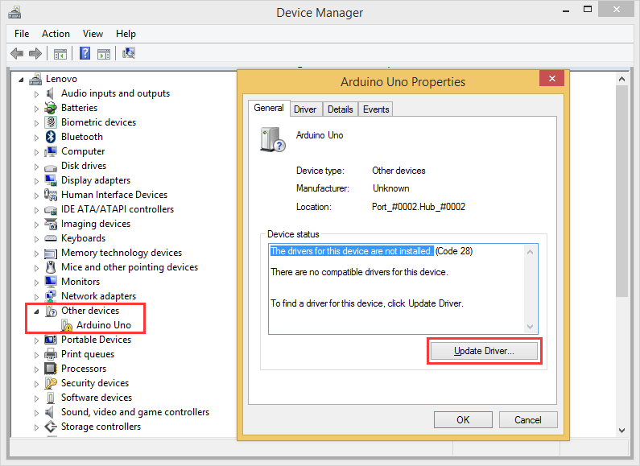   
* Double click the **Arduino Uno** and click **Update Driver...**.   
* Follow the instructions below and update the driver.  
    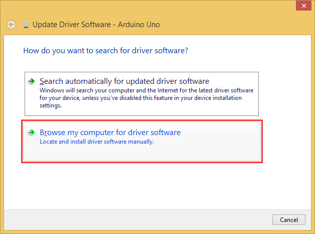  
    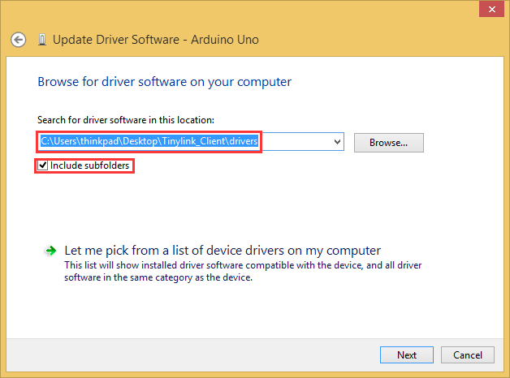  
    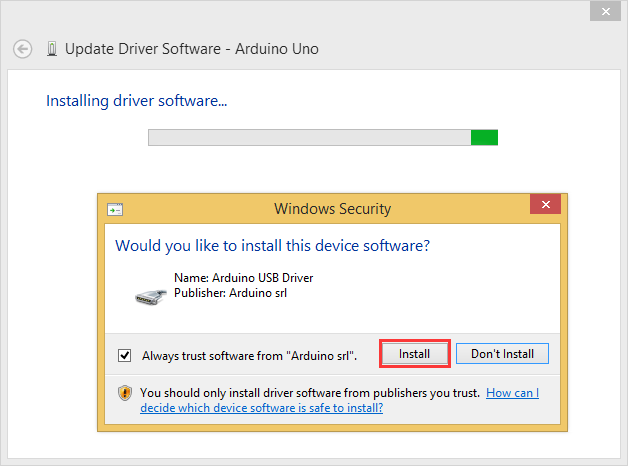  
    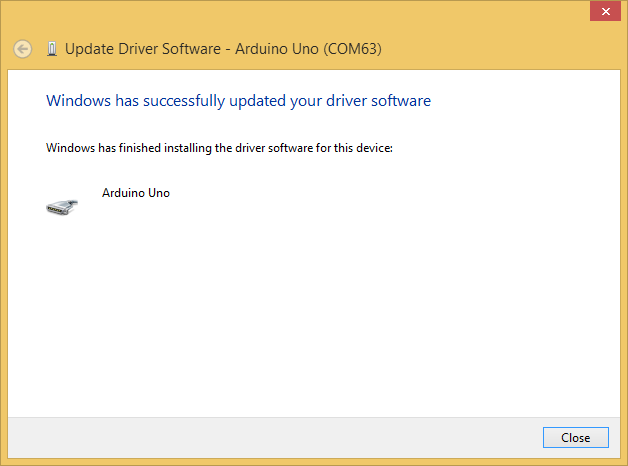

### 2.1.2 For Linux users
We have been working on TinyLink Linux version, but it is not ready yet.

## 2.3 Register on TinyLink website
One should register on TinyLink website before he/she can develop an IoT application.

* Open the **TinyLink.exe** in **TinyLink_Client** folder.
* Click **"注册(Register)"** button on the right.  
    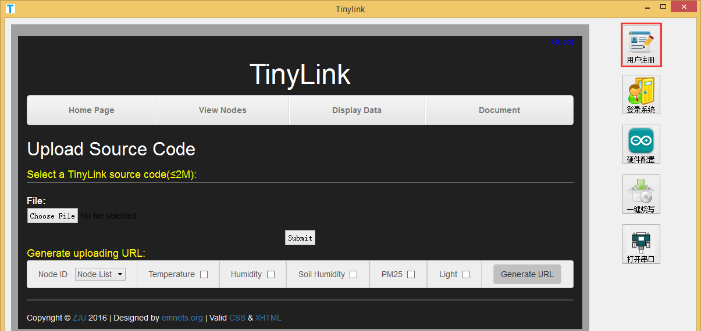
* Fill in the blanks with the user's basic information, as well as the experience in IoT development.  
    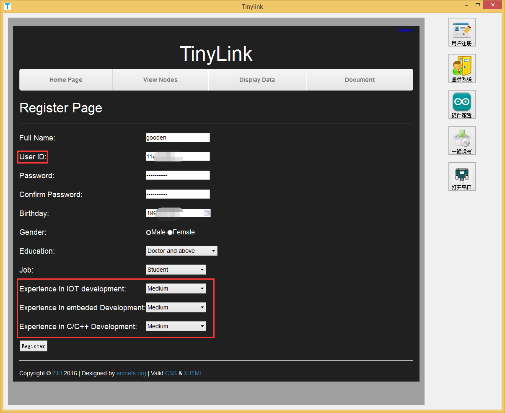
* After registration, we can click the **"登陆(Login)"** button on the right, and input the account information we have just registered.  
    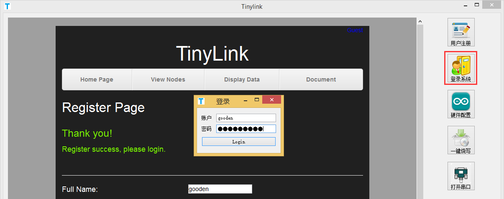

**Note: After all these steps above, we have completed the preparation for TinyLink.**

# 3. Learn Through TinyLink Examples
Now we can write our own source code to create IoT applications. We will present three examples here for better understanding.

## 3.1 LED blink
We will turn one of the boards LEDs on for one second and then off for one second, repeatedly.
This is an easy and common example.

### Step 1 - Write the source code
* We have implemented an online [API document](api_page.php), where developers can search for their desired APIs. For example, we need to use **LED** module, we can search for "LED" and find the **TL_LED** library.
* Every TinyLink program contains two basic functions, the **setup()** function and the **loop()** function. The setup function deals with functions like module initialization, while the loop function are executed periodically after the setup function.
* Here is the source code. Just copy it and save it to the local disk as "Blink.cpp".

		void setup() {
		}
		
		void loop() {
            TL_LED.toggle();
            TL_Time.delayMillis(1000);
		}

### Step 2 - Upload the source code via TinyLink client
* Open the **TinyLink.exe**, and log in just in case.
* Select and upload the source code file **"Blink.cpp"** by clicking the submit button.    
    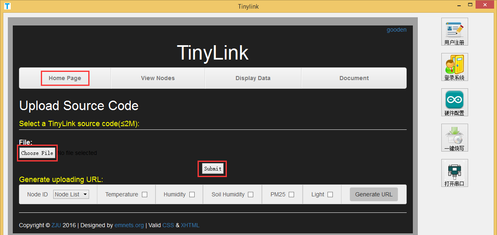

### Step 3 - Generate the hardware and the software
* Once the generation procedure is successful, there will be a status bar informing us.  
    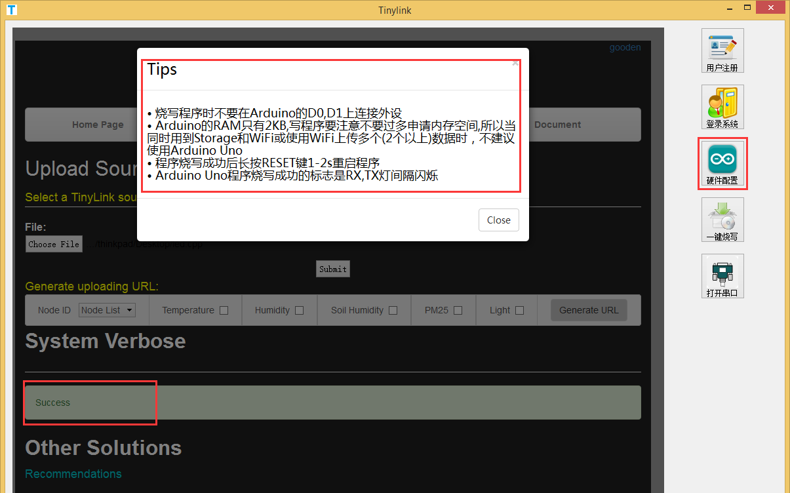
* Also, there will be some **Tips** about the generated hardware configuration. We should pay attention to them.
* After observing the success information, TinyLink generates the hardware configuration for the source code and cross-compiles the software system for the hardware. We can watch the hardware connection figure by clicking the **"硬件配置(Hardware Configuration)"** button.    

### Step 4 - Assemble the hardware components
Next, we will assemble the hardware for the application with the help of connection figure shown in **Hardware Connection**.

* We need to carefully look at the hardware components in the figure. The mainboard are not the same all the time. In this case, the mainboard is **Arduino UNO**.
* Since there is only one hardware component, Arduino UNO, in this example, we have completed the assembling procedure.   
    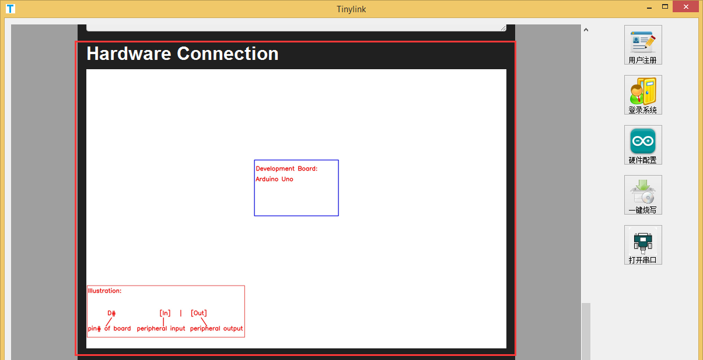

### Step 5 - Burn the software system
* Then, we will attach the assembled hardware to our computer. We plug the Type B USB cable into Arduino UNO on one side, and on the other side into the USB port on the computer.
* Afterwards, we will burn the software system onto the assembled hardware, i.e., Arduino UNO in this case. We just need to click the **"一键烧写(Click-and-burn)"** button, and wait until it is done.  
    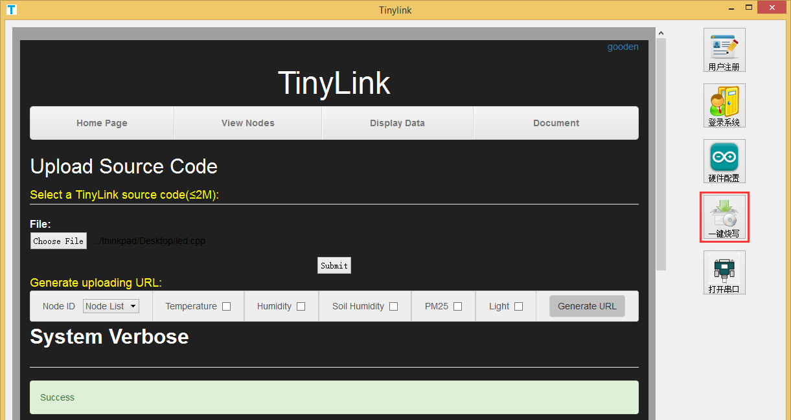  
    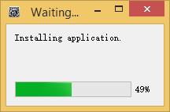  
    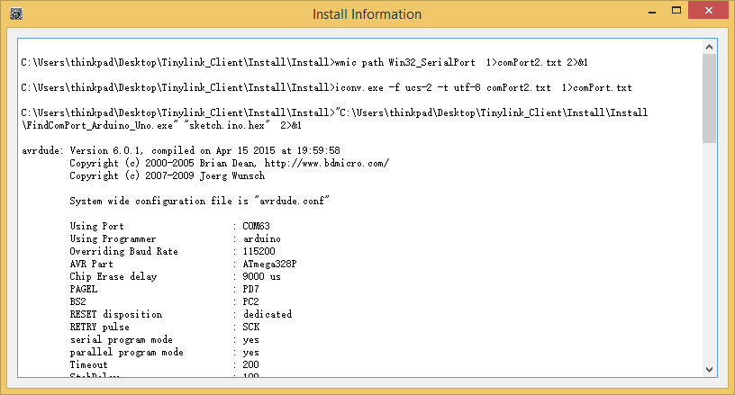
* **Note that when the following text is shown, it means the program is burnt into Arduino UNO successfully.**  
    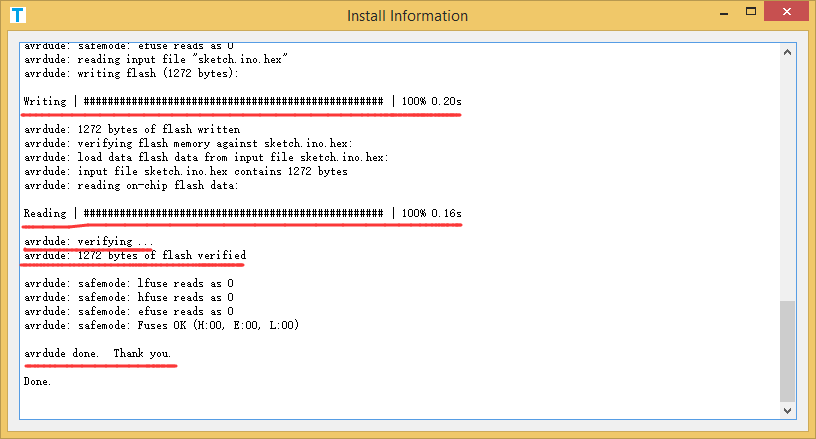

### Step 6 - Watch the results
* Finally, we have built our first IoT application, LED Blink, using TinyLink. Now we can observe that the LED on Arduino UNO is toggling every second.

## 3.2 Upload the ambient light data to Internet via WiFi
Firstly, we will sample the ambient light in the form of integer numbers. Then we will upload the data to the cloud via WiFi every second. And finally we can observe the visualized data from both the website and the Android App.

The steps for creating this example is similar to the previous example.

### Step 1 - Register a node
* Click the tab **View Nodes** in **TinyLink_Client.exe**, and then click **Register a new node**.  
    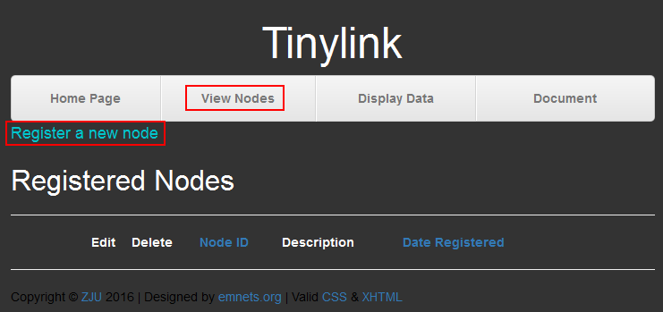  
* Input the **Node ID** and its **Description**, and register for this node.  
    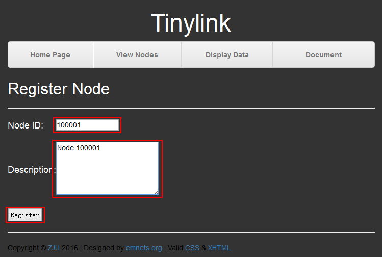
* Finish the registration.  
    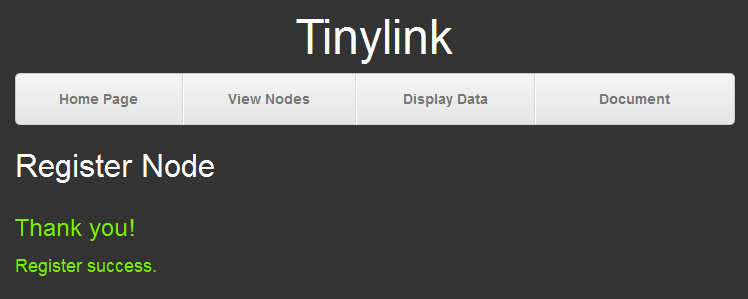

### Step 2 - Write the source code
* First, we need to generate the uploading URL for the code. Click the boxes after the intended items and then click the button **Generate URL**. Then the URL is generated as below. We need to replace the **xxx** in the URL with the sampled data before we use them.  
    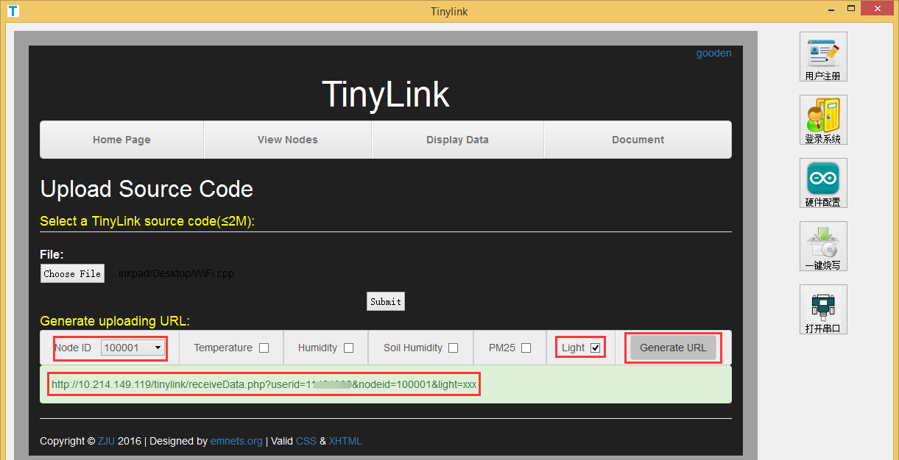

* Here is the source code.  
Just copy it and save it to the local disk as "Light_WiFi.cpp".

		TL_HTTP http = TL_WiFi.fetchHTTP();
        void setup() {
            TL_WiFi.init();
            TL_WiFi.join("SSID", "Password");
        }

        void loop() {
            TL_Light.read();
            double light = TL_Light.data();
            http.get("http://10.214.149.119/tinylink/receiveData.php?userid=12345&nodeid=100001&light=" + String(light));
            TL_Time.delayMillis(1000);
        }

### Step 3~5 - Get the hardware and the software
Since they are similar to Steps 2-4 in the previous example, we will not discuss them in details.

* The included hardware components are listed as below.  

    |Component|Figure|
    |:---:|:---:|
    |Arduino UNO||
    |Base Shield V2 (3.3V)||
    |Grove UART WiFi||
    |Grove Light Sensor||

* The hardware connection figure is shown as below.  
    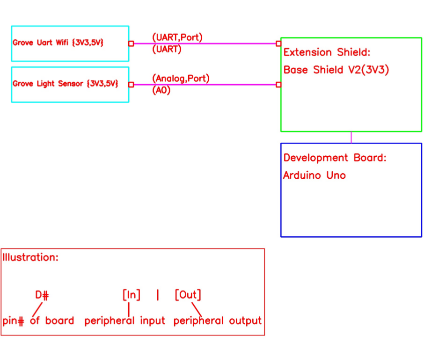
* The assembled node is shown as below.  
    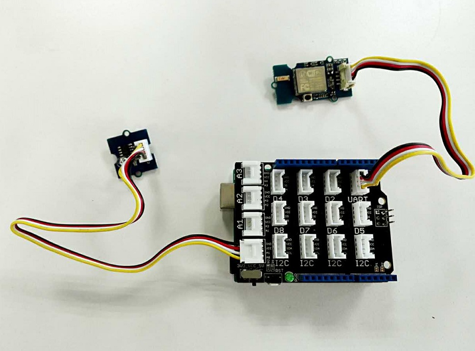

### Step 6 - Burn the software system
**Note that when connect any hardware component to UART port (or D0, D1 pins) on Arduino UNO, we shall NOT connect the component BEFORE we upload the software system.**  
We first upload the binary program, and then connect the hardware component.  
We set an interval of 10 seconds in the code, which is long enough for us finish connecting the WiFi module. 

### Step 7 - Watch the visualized results
* Watch the visualized data in tab **Display Data** of **TinyLink_Client.exe** by choosing the right Node ID (i.e., 100001) from the **Nodes List**.  
    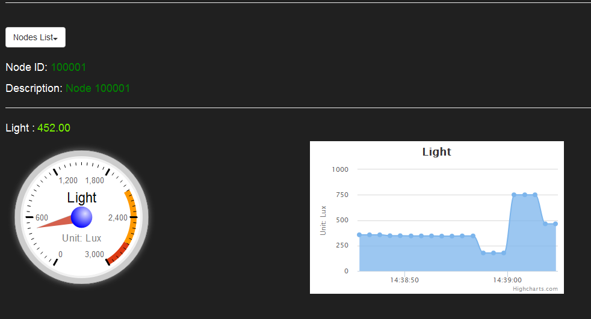  
* **Note that if there is no data displayed in this page, there may be something wrong with the uploading procedure. A simple method to solve this is to press the RESET button on the Arduino UNO.**  
       


## 3.3 A simple smart houseplant device
After the two basic examples above, we will try a challenging example which is to build a smart node for houseplant.  
This node aims at monitoring the ambient light and soil humidity of the houseplant every two seconds, and upload the data to the cloud as well as save them in the local storage in case of network failure.

### Step 1 - Write the source code
```
	TL_File fp;
    TL_HTTP http;
    void setup() {
        TL_Serial.begin(9600);
        TL_WiFi.init();
        TL_WiFi.join("SSID", "Password");
        TL_Storage.begin();
        fp = TL_Storage.open("test.txt", "w");
        http = TL_WiFi.fetchHTTP();
    }

    void loop() {
        if (TL_Serial.available()) {
            fp.close();
            while (true);
        }
        TL_Light.read();
        TL_Soil_Humidity.read();
        double l = TL_Light.data();
        double s = TL_Soil_Humidity.data();
        TL_Serial.println(String("Light: ") + l + " Soil:" + s);

        String url = String("http://10.214.149.119/tinylink/receiveData.php?userid=12345&nodeid=100001&");
        url = url + "light=" + l + "&soil_humidity=" + s;
        TL_Serial.println(url);
        bool res = http.get(url);
        if (res == true) {
            TL_Serial.println(String("Successfully send data via WiFi"));
        } else {
            TL_Serial.println(String("Fail to send data via WiFi"));
        }

        int cc = fp.write(String(l) + String(", ") + String(s));
        TL_Serial.println(String("Write ") + String(cc) + String(" char into storage"));

        TL_Time.delayMillis(2000);
    }
```
In this example, we use five different modules, which are **Serial, WiFi, Storage, Light, Soil_Humidity**.

### Step 2~5 - Get the hardware and the software, and burn the software into the assembled node
* Since they are similar to the previous example, we will not discuss them in details. The main difference is that the mainboard, LinkIt One, is used in the final hardware platform. LinkIt One contains the built-in storage module and the built-in WiFi module. **Note that the WiFi antenna should be attached to the reverse side of LinkIt One.**

* The included hardware components are listed as below.

    |Component|Figure|
    |:--:|:--:|
    |LinkIt One||
    |Base Shield V2 (5V)||
    |Grove Light Sensor||
    |Soil Moisture Analog Sensor||

* Here, we click **"Recommendations(其他方案)"** to find more solutions.
    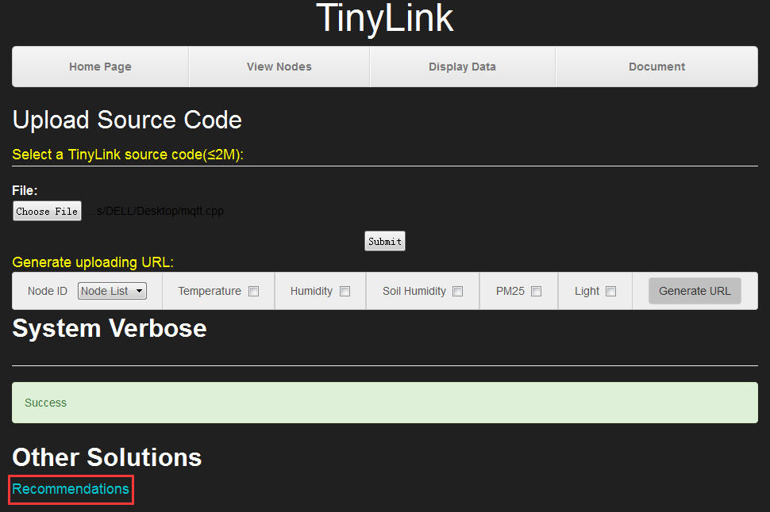  
* Then we choose LinkIt One platform.
   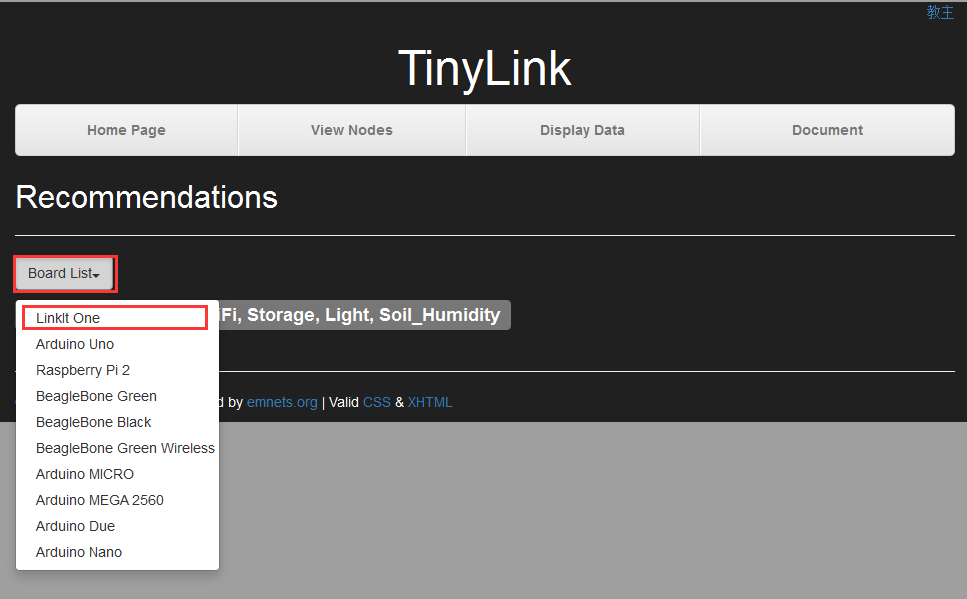 
* Following, We get a recommendaion table for LinkIt One, there are 16 sets of solutions generated according to function list (Serial, WiFi, Storage, Light and Soil_Humidity). We should choose the solutions which have been implemented.
   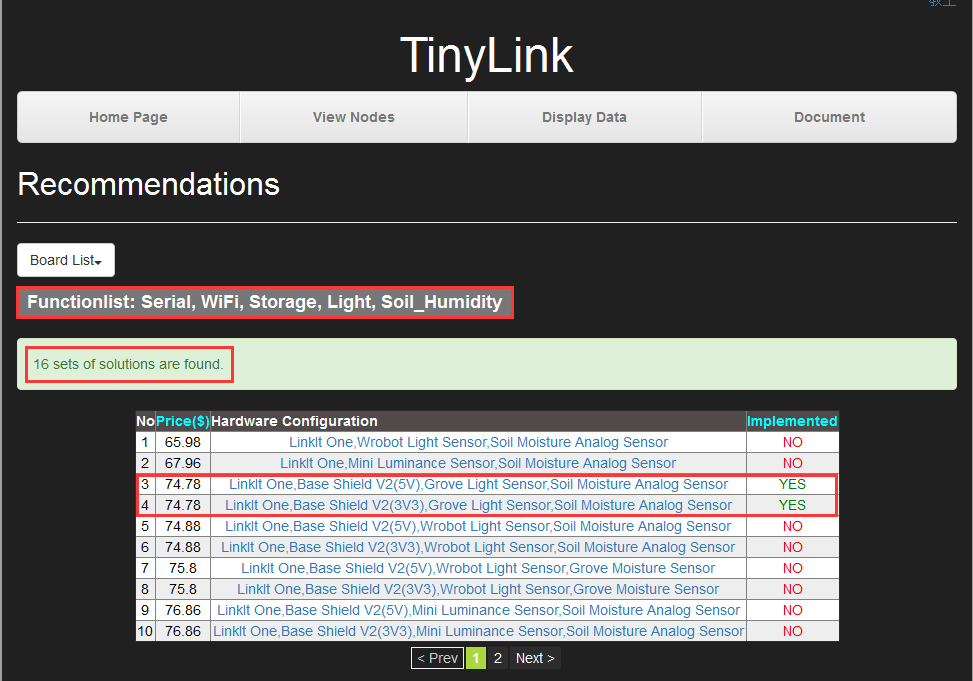 
* The hardware connection figure is shown as below.  
   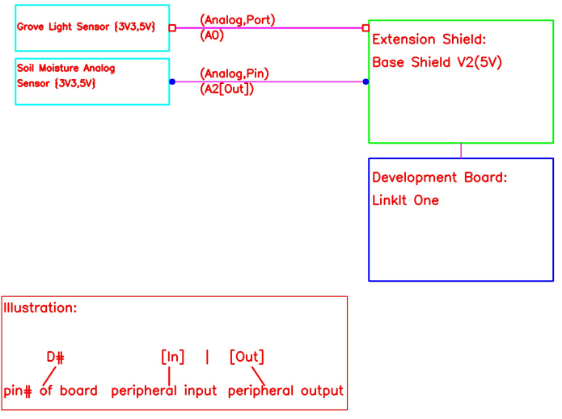  
* **Note that the Soild Humidity Analog Sensor utilizes dupont lines to attach to A2 pin on the LinkIt One. We should be careful when attaching the dupont lines. It may cause permenant damage to the sensor if we connect the positive pin and negative pin in a contrary way.** The clear figure of the connection between the LinkIt One and the Soil Humidity Analog Sensor is shown as below.
    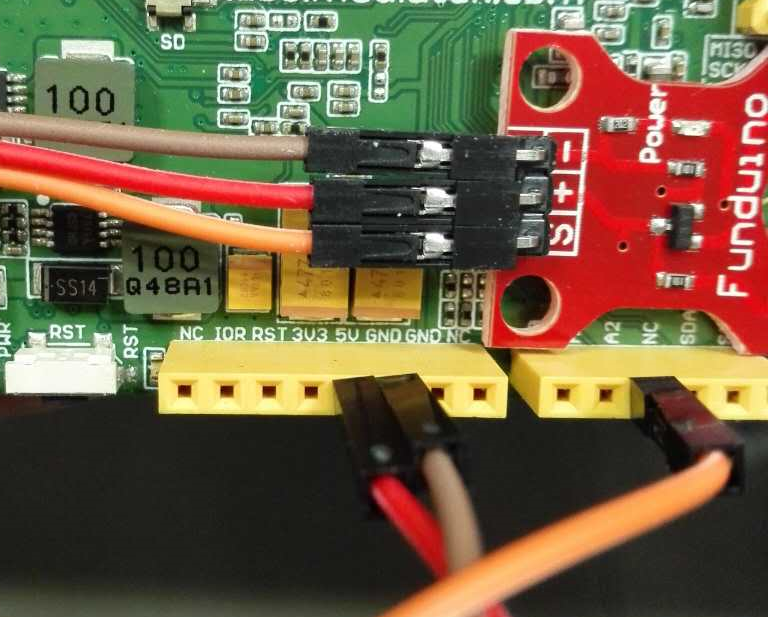
* We can visit the pinout diagram for both mainboards on the website for more details.  
    **Arduino Uno Pinout Diagram**
    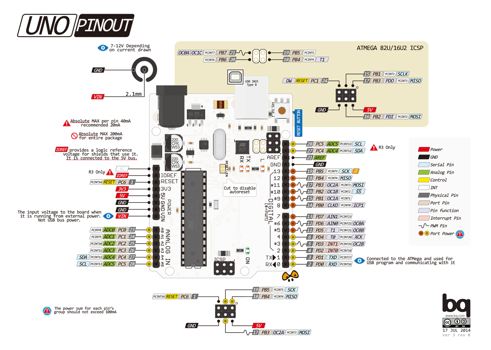  
    **LinkIt One Pinout Diagram**
    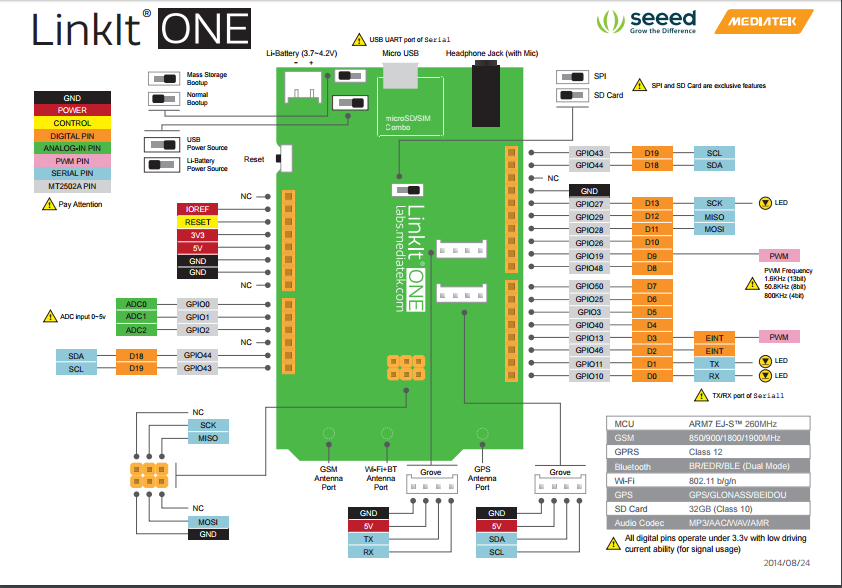  
* The assembled hardware platform is shown as below.   
    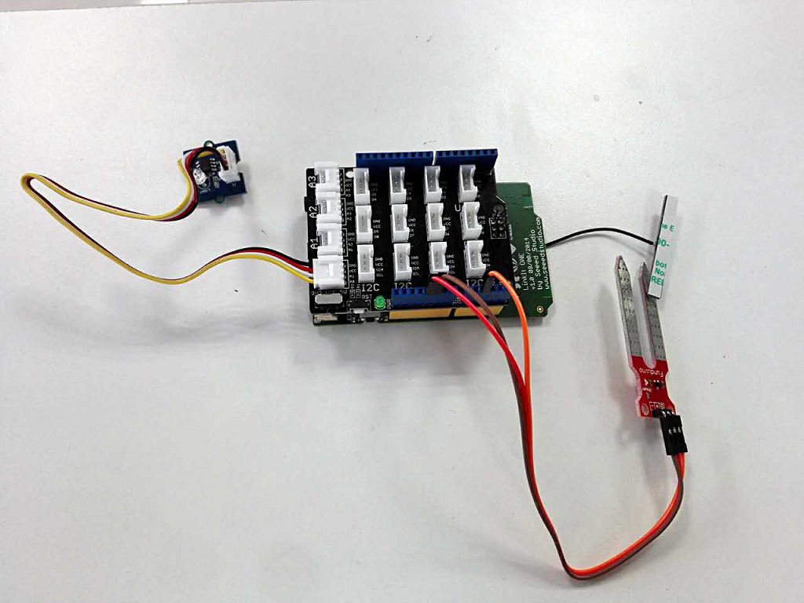

### Step 6 - Watch the visualized results
This time, we can observe data from two difference sensors, including the Grove Light Sensor and the Soil Humidity Sensor.
 
* The visualization page on the website is shown as below.  
    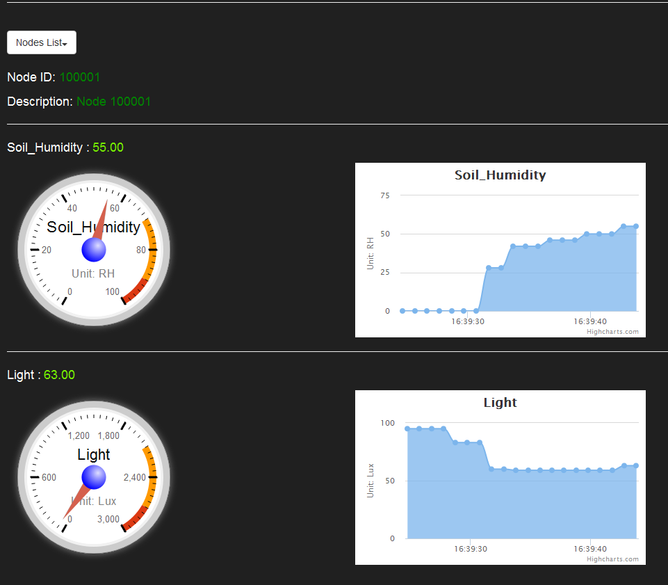  
* Also, we can observe the results through Serial port. We can click on the **"Open Serial(打开串口)"** to start the **"OpenJumper串口调试器.exe"**.  
    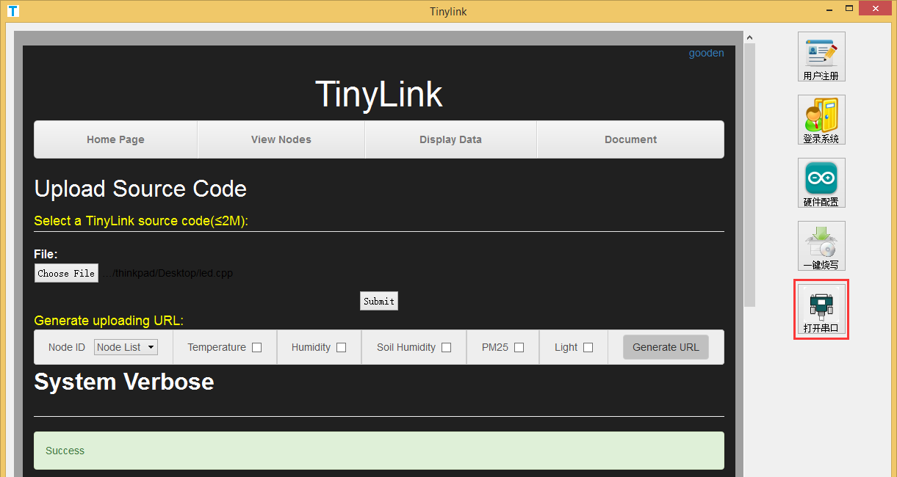 
* Then we click on **"Open Serial(打开串口)"** and watch the results printed in the received area. We should close the Serial by clicking on **"Close Serial(关闭串口)"** once we have done observing.  
    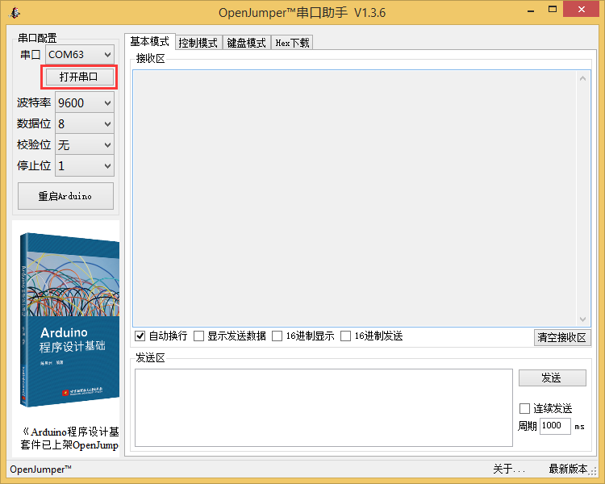  
    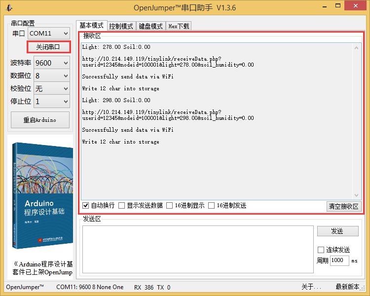 

## 3.4 Connect TinyLink node to current IoT platform
Here, we will show a complete case which illustrates the combination of TinyLink and current IoT platform (eg. IBM Watson, OneNet).
This application aims at monitoring the ambient temperature, humidity and PM2.5 in house every two seconds, and upload the data to OneNet.

### Step 1 - Write the source code
    TL_MQTT mqtt;

    int port = 6002;
    char serverName[]= "183.230.40.39";     // Server ip
    char clientName[] = "DeviceID";         // Device ID
    char topicName[] = "$dp";               // Topic name
    char userName[] = "ProductID";          // Product ID
    char password[] = "Authentication";     // Authentication information

    void setup() {
        TL_WiFi.init();
        bool b = TL_WiFi.join("SSID","Password");
        mqtt = TL_WiFi.fetchMQTT();
        int a = mqtt.connect(serverName, port, clientName, userName, password);
    }

    void loop() {
        TL_PM25.read();
        TL_Temperature.read();
        TL_Humidity.read();
        char buf[180];
        buf[0]=0x01;
        String payload = "{";
        payload += "\"datastreams\":[";
        payload += "{\"id\":\"PM25\",";
        payload += "\"datapoints\":[{";
        payload += "\"value\":";
        payload += TL_PM25.data();
        payload += "}]},";
        payload += "{\"id\":\"Temperature\",";
        payload += "\"datapoints\":[{";
        payload += "\"value\":";
        payload += TL_Temperature.data();
        payload += "}]},";
        payload += "{\"id\":\"Humidity\",";
        payload += "\"datapoints\":[{";
        payload += "\"value\":";
        payload += TL_Humidity.data();
        payload += "}]}";
        payload += "]}";
        int payloadlength = payload.length();
        buf[1] = (payloadlength & 0xFF00) >> 8;
        buf[2] = payloadlength & 0xFF;
        payload.toCharArray( buf+3, 170 );
        int res = mqtt.publish(topicName, buf, payloadlength+3);
        TL_Time.delayMillis(2000);
    }
* **Note: This program may not run successfully on Arduino Uno, because the RAM of Arduino Uno is only 2KB. We suggest the length of payload no more than 100 if you insist on using Arduino Uno.**  

### Step 2~5 - Get the hardware and the software, and burn the software into the assembled node
* Since they are similar to the previous example, we will not discuss them in details. Here we still use LinkIt One.
* The included hardware components are listed as below.

    |Component|Figure|
    |:--:|:--:|
    |LinkIt One||
    |Base Shield V2 (5V)||
    |Grove Temperature and Humidity Sensor||
    |SDS018||  

* The hardware connection figure is shown as below.  
    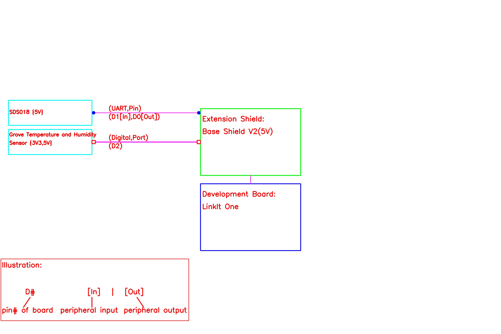

* The assembled hardware platform is shown as below.   
    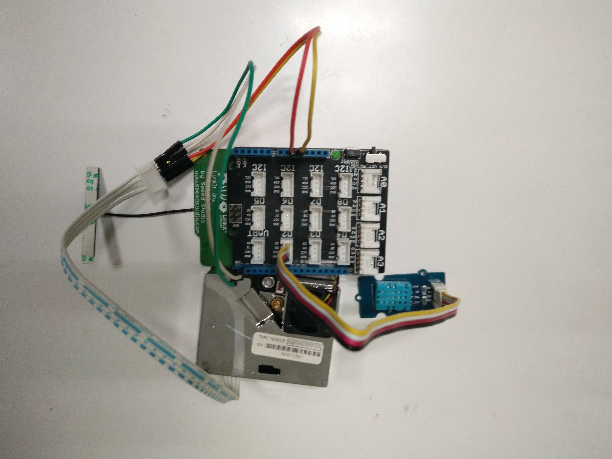

### Step 6 - Watch the visualized results
This time, we can observe data from OneNet IoT platform.

* Our device has connected to IoT platform successfully. 
    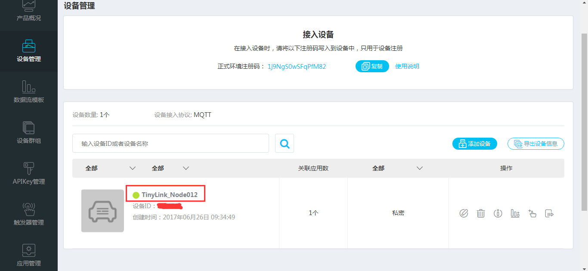
* OneNet IoT platform receives data from remote device in real time.
    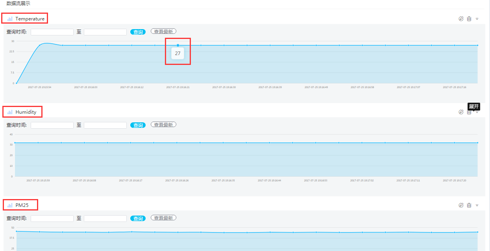

# 4. Start Your Journey
Now it is time you should start your journey with TinyLink.  
Do not forget to finish the experiment report after you have done all the experiments.  
Good luck!